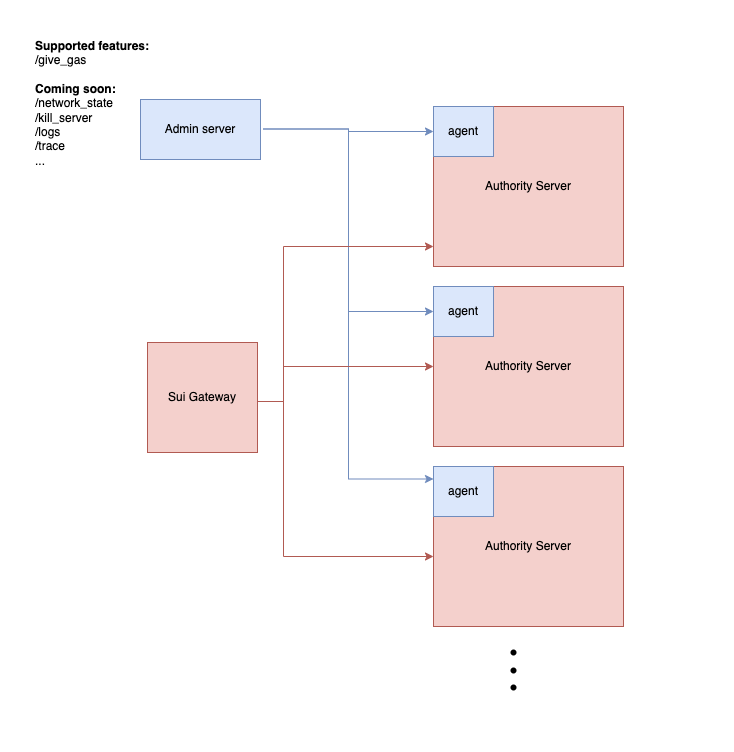

# Overview

TBD

## Devnet Admin

At a high level, the devnet Admin simply provides additional features/control over the network and its state.
A tiny agent runs in the authority server machine which handles requests from the Admin.


The red portions represent normal Sui operation while the blue portions represent the devnet Admin operations.
It is important to note that the devnet Admin is not part of Sui.

There are 7 authorities in the devnet, each hosted on an individual EC2 server (subject to change).

Currently the Admin only support the `/give_gas` endpoint which gives the caller some gas
Additional endpoints for killing authorities, getting logs, checking network state, etc will be added incrementally

## Devnet version

The devnet is currently pinned to authority code on main commit `3ac9ae193c440da7b753bb7d976f257d6e88955e` and will be manually updated on a cadence TBD

# Quickstart

## 1. Build Sui

`cargo build --release`

## 2. Copy configs

To access the network, you need to start Sui with a config file which points to the authority servers.
Save the JSON text below as `wallet.conf` and copy it to `{build_dir}/target/release`.

```
{
  "accounts": [
  ],
  "keystore": {
    "File": "./wallet.key"
  },
  "gateway": {
    "embedded": {
      "authorities": [
        {
          "name": "bf96d38a584bca4fc3824373cf238998467e7e6b566bc4b9da5b692dc875dc1e",
          "host": "54.237.88.139",
          "base_port": 10007
        },
        {
          "name": "b05dd3049a4c27488fd8138cadc0692f845f0d0fb194e66dc60a51ff66185f28",
          "host": "100.25.16.233",
          "base_port": 10008
        },
        {
          "name": "73be3810d607f3e50d0ae6902dd331ee3df0d4cb20b797223a69c7106606b3af",
          "host": "54.236.17.142",
          "base_port": 10009
        },
        {
          "name": "e63e4cfbd2cb9caebcf24c16a27f5d152d57c781f4df8a50bccf86bdba0cd316",
          "host": "54.144.139.247",
          "base_port": 10010
        },
        {
          "name": "e1f948150c177b5073a98861f24e9e8385bb0d22481412aa72a5ac94d8ff6761",
          "host": "54.165.165.197",
          "base_port": 10011
        },
        {
          "name": "4b3a2565f82edb628c7411e0f5a2d93753cc358aa0cc287f0649e63ad5cd284f",
          "host": "100.26.142.90",
          "base_port": 10012
        },
        {
          "name": "ce7085109cc9dc25ff1e3c287448895ee4e07c19504b2934479aeaeaf0d6d1aa",
          "host": "54.236.27.158",
          "base_port": 10013
        }
      ],
      "send_timeout": {
        "secs": 4,
        "nanos": 0
      },
      "recv_timeout": {
        "secs": 4,
        "nanos": 0
      },
      "buffer_size": 650000,
      "db_folder_path": "./client_db"
    }
  }
}
```

## 3. Run Sui Wallet CLI

Start `./wallet` and it will connect to the servers as shown below

```
   _____       _    _       __      ____     __
  / ___/__  __(_)  | |     / /___ _/ / /__  / /_
  \__ \/ / / / /   | | /| / / __ `/ / / _ \/ __/
 ___/ / /_/ / /    | |/ |/ / /_/ / / /  __/ /_
/____/\__,_/_/     |__/|__/\__,_/_/_/\___/\__/
--- sui wallet 0.1.0 ---

Managed addresses : 0
Keystore Type : File
Keystore Path : "./wallet.key"
Gateway Type : Embedded
Client state DB folder path : "./client_db"
Authorities : ["54.237.88.139:10007", "100.25.16.233:10008", "54.236.17.142:10009", "54.144.139.247:10010", "54.165.165.197:10011", "100.26.142.90:10012", "54.236.27.158:10013"]

Welcome to the Sui interactive shell.

sui>-$
```

## 4. Create a new address

```
sui>-$ new-address
Created new keypair for address : C4C6D0A6A39B5DE4D6C85AD4ADAA667DE2AB65A6
```

We will be using `C4C6D0A6A39B5DE4D6C85AD4ADAA667DE2AB65A6` as our address in this example

## 5. Request gas from the Admin

The new address will have no objects. Confirm this by checking the objects

```
sui>-$ objects --address C4C6D0A6A39B5DE4D6C85AD4ADAA667DE2AB65A6
Showing 0 results.
```

In a new terminal, request gas from the Admin using  `curl -v "http://44.201.86.217:8080/give_gas?recipient={YOUR_ADDRESS}"`

```
curl "http://44.201.86.217:8080/give_gas?recipient=C4C6D0A6A39B5DE4D6C85AD4ADAA667DE2AB65A6" 
```

You should get a response such as

```
{"new_obj": "C0363325560CACC1C082F32B4335474CED9B423B"}
```

This is your new gas object which will have a value `10000`

## 6. Sync address in Sui wallet CLI to download new gas

```
sui>-$ sync --address C4C6D0A6A39B5DE4D6C85AD4ADAA667DE2AB65A6
Client state sync complete.
```

Confirm that the new gas object is present and has value 10000

```
sui>-$ objects --address C4C6D0A6A39B5DE4D6C85AD4ADAA667DE2AB65A6
Showing 1 results.
(CAC2E3B16FB7F57F46A21FF39502569CFD14D533, SequenceNumber(2), o#3cc239b9f8331410797df91f2d67f132abd6eb184fae09b7c9760cbeb5a389ef)

sui>-$ gas --address C4C6D0A6A39B5DE4D6C85AD4ADAA667DE2AB65A6
                Object ID                 |  Version   |  Gas Value 
---------------------------------------------------------------------- 
 CAC2E3B16FB7F57F46A21FF39502569CFD14D533 |     2      |    10000  
```
